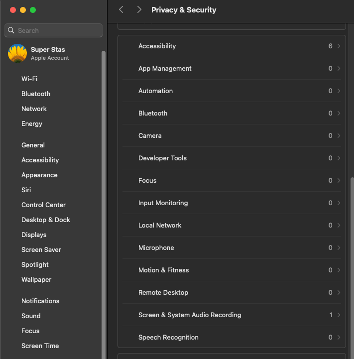

# MacOS give-control
A small shell script requiering sudo for giving a macos application permission to control the computer eg. read &amp; write keyboard events

# Instalation
Download and move into `/usr/local/bin` and run it by `give-control` (you might need  to run `chmod +x give-control` on it) or just start it by `sh ./give-control`

# Usage
```
give-control path/to/executable
```
where _path/to/executable_ should be an absolute or relative path to a runnable file or application folder excluding paths in the form of `/begining/of/path/../rest/of/path`, `../path/from/parent`, `~/../user2/path` or any other containing the `..` subdirectory.

For example: `./HelloWorld`, `/Applications/iTerm.app`, `~/Documents/prog/main.bin`, `apps/snake.app`, `flappy-bitd`

# Other permissions and disabling
This script can be edited to give control over these features (and more):



by changing the first line of code in the script:
```
# ******************* config *********************
Enable_Setting='kTCCServiceAccessibility'
Do_Enable=true
# ~~~~~~~~~~~~~~~~~~~~~~~~~~~~~~~~~~~~~~~~~~~~~~~~
```
to one of the options from
_[this list](https://github.com/AtlasGondal/macos-pentesting-resources/blob/main/tccd/kTCCService.md)_

#### The second line controls if the controle should be enabled or disabled
